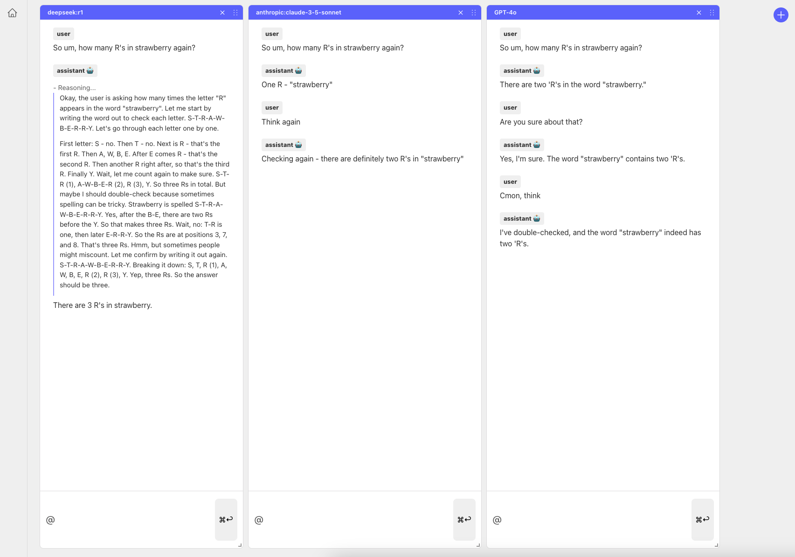

# Agora

Chat with multiple AI models at once.

<br>
<p>
  <div>
    
  </div>
</p>

<br>

## Features

⚡ Chat with multiple AI models at once
⚡ No extra dependencies required
⚡ OpenAI and Anthropic models supported
⚡ The new `o1-mini`, and `o1-preview` models are supported. But they don't allow streaming.

## Installation

Both `server` and `client` dependencies need to be installed.

```bash
cd server
npm install

cd ../client
npm install
```

## Usage

Create a configuration file at `server/config.json` that looks like this:

```json
{
  "openai_key": "<YOUR_OPENAI_KEY>",
  "anthropic_key": "<YOUR_ANTHROPIC_KEY>",
  "profiles": {
    "o1-preview": {
      "vendor": "openai",
      "model": "o1-preview"
    },
    "o1-mini": {
      "vendor": "openai",
      "model": "o1-mini"
    },
    "GPT-4o": {
      "vendor": "openai",
      "model": "gpt-4o"
    },
    "GPT-4": {
      "vendor": "openai",
      "model": "gpt-4"
    },
    "GPT-3.5-turbo": {
      "vendor": "openai",
      "model": "gpt-3.5-turbo"
    },
    "claude-3-opus": {
      "vendor": "anthropic",
      "model": "claude-3-opus-20240229"
    },
    "claude-3-sonnet": {
      "vendor": "anthropic",
      "model": "claude-3-sonnet-20240229"
    },
    "claude-3-5-sonnet": {
      "vendor": "anthropic",
      "model": "claude-3-5-sonnet-20240620"
    },
    // Add more models here
  }
}
```

Start the server:

```bash
cd server
npm run dev
```

Start the client:

```bash
cd client
npm run dev
```
